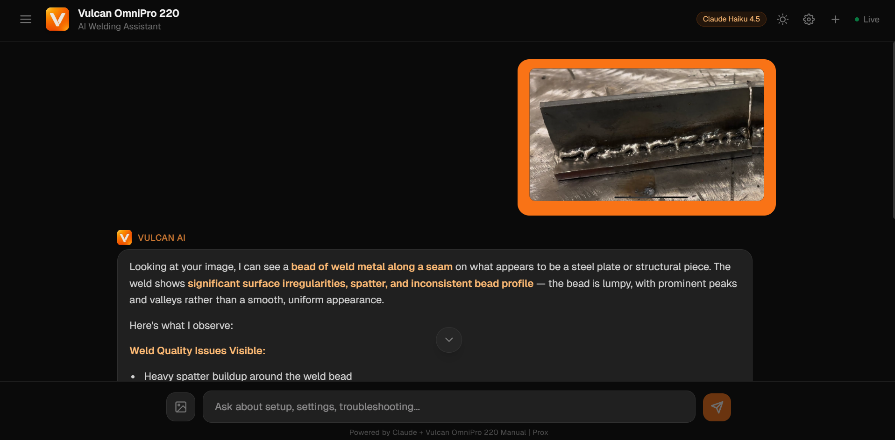

<div align="center">

# Vulcan OmniPro 220 - AI Welding Assistant

*<span style="color:#22c55e;">●</span> [prox-vulcan-ai.vercel.app](https://prox-vulcan-ai.vercel.app)*

</div>

<br>


A domain-grounded AI agent for the Vulcan OmniPro 220 multiprocess welder. Every answer is sourced from the machine's own manual, with page citations rendered as clickable badges that open the actual manual page. The agent generates interactive artifacts (polarity diagrams, duty cycle calculators, troubleshooting flowcharts, technique guides) rendered in sandboxed iframes. Upload a photo of your weld and get an honest quality assessment cross-referenced against the manual.

**Video walkthrough:** [Watch on YouTube](https://youtu.be/8ABXC3LO0Qw)

---

## Features

- **Hybrid RAG search** - Vector (ChromaDB) + BM25 keyword search, merged via Reciprocal Rank Fusion. Semantic queries like "my welds are bubbly" find porosity content; exact queries like "DCEN" or "200A" match verbatim.
- **Interactive artifacts** - Polarity wiring diagrams, duty cycle calculators, troubleshooting flowcharts, and technique angle guides. Generated as React components, rendered in sandboxed iframes with dark-themed styling.
- **Pipeline transparency** - Animated status chips show classify > retrieve (chunk count) > generate in real time via SSE events.
- **Multimodal input** - Drag-and-drop weld photos. Claude Vision analyzes defects (or confirms quality) and cross-references the manual. No default-to-praise: if the weld is bad, it says so.
- **Clickable page citations** - Page references in responses are rendered as clickable badges that open the actual manual page in a modal overlay. Inside artifacts, page references use `postMessage` to trigger the same modal.
- **Conversation memory** - Sidebar with auto-titled chat history (localStorage). New chat, load, delete. Last 8 messages (4 exchanges) sent as context for follow-ups.
- **Document library** - Expandable panel in sidebar showing 3 ingested documents, page counts, and extraction methods.
- **BYOK** - Users enter their own Anthropic API key (stored in browser only, never sent to backend). Model selector: Haiku 4.5, Sonnet 4.6, Opus 4.6.
- **Dark/light theme** - Full toggle via CSS custom properties. Every element adapts, including artifact iframes.
- **Question classification** - Claude Haiku classifies each question into one of 5 categories (polarity, duty_cycle, troubleshoot, settings, general). Each category injects a type-specific artifact prompt. Classifier is hardcoded to Haiku (~$0.0003/call) regardless of user model selection.

<p>


</p>



---

## Architecture

```
User message (text + optional image)
        |
        v
  +-------------------------------------+
  |  1. Classify (Claude Haiku 4.5)     |  ~$0.0003, max_tokens=10
  |     > polarity | duty_cycle         |  Always Haiku, regardless of
  |     > troubleshoot | settings       |  main model setting
  |     > general                       |
  +-----------------+-------------------+
                    |
                    v
  +-------------------------------------+
  |  2. Hybrid Retrieval (local, $0)    |
  |     ChromaDB semantic search        |  cosine similarity
  |   + BM25 keyword search             |  exact term matching
  |     merged via Reciprocal Rank      |  k=60, with 50% threshold
  |     Fusion                          |  4-7 chunks per query
  +-----------------+-------------------+
                    |
                    v
  +-------------------------------------+
  |  3. Generate (Claude, streamed)     |  Type-specific artifact prompt
  |     Base system prompt              |  + RAG context + conversation
  |   + category artifact prompt        |  history (last 4 exchanges)
  |   + polarity/settings hardcoded     |  + image if uploaded
  |     facts as guardrails             |
  +-----------------+-------------------+
                    | SSE stream
                    v
  +-------------------------------------+
  |  Frontend                           |
  |  - Pipeline status chips (SSE)      |
  |  - Token-by-token markdown render   |
  |  - Artifact extraction + iframe     |
  |  - Page citation badges + modal     |
  +-------------------------------------+
```

### SSE Event Protocol

| Event | Payload | Purpose |
|-------|---------|---------|
| `status` | `{step, state, result?, chunks?}` | Pipeline progress (classify/retrieve/generate) |
| `metadata` | `{question_type, model}` | Classification result before tokens start |
| `token` | `{text}` | Streaming text chunks for progressive display |
| `error` | `{message}` | API errors (401, 404, 429) with user-friendly messages |
| `done` | `{tokens_used}` | Stream complete with total token usage |

### Hybrid Search

The system runs both ChromaDB vector search and BM25 keyword search on every query, then merges with Reciprocal Rank Fusion (`RRF_score = 1/(rank_vector + 60) + 1/(rank_bm25 + 60)`). Chunks appearing in both lists get boosted. A 50% threshold filter drops weak matches. Retrieval depth varies by question type: troubleshooting pulls 7 chunks, polarity pulls 4. Both searches are local, zero API cost. The BM25 index is built once at server startup.

### Artifact Rendering

Claude's response contains React code in `<artifact type="react">` tags. The frontend extracts this and renders it in a sandboxed iframe with React 18, ReactDOM, and Babel (loaded sequentially from CDN to prevent race conditions). `sandbox="allow-scripts"` with no `allow-same-origin`. Function-name aliasing maps any component name to `Component`. ResizeObserver dynamically adjusts iframe height (capped at 520px). Dark theme CSS is injected into the iframe to match the parent app.

### Conversation State

The frontend holds the full message history and sends the last 8 messages (4 exchanges) with every request. Artifact code in assistant history is stripped and replaced with `[interactive artifact was shown]` to save tokens. The backend is stateless.

---

## Knowledge Extraction

### Source Material

| PDF | Pages | Content | Extraction |
|-----|-------|---------|------------|
| `owner-manual.pdf` | 48 | Full technical reference: setup, all 4 processes, specs, troubleshooting | pdfplumber (text + tables) |
| `quick-start-guide.pdf` | 2 | Abbreviated setup with diagrams | pdfplumber (text) |
| `selection-chart.pdf` | 1 | Process selection matrix (pure image, no extractable text) | Claude Vision API |

pdfplumber was chosen over pypdf because the manual's critical data lives in tables (duty cycles, amperage ranges, troubleshooting matrices). pypdf destroys row/column structure, making values like "200A" and "25%" no longer associated. pdfplumber extracts tables as structured markdown, preserving these relationships.

`selection-chart.pdf` yields 0 characters from any text extractor. `ingest_vision.py` converts each page to JPEG at 200 DPI via Poppler, sends it to Claude Vision, and ingests the result into ChromaDB with `extraction: "vision"` metadata.

### Chunking and Storage

Text is split into 500-word chunks with 50-word overlap. Table text is deduplicated against full-text extraction. ChromaDB uses all-MiniLM-L6-v2 embeddings (100% local). The pre-built index is committed to git so reviewers skip ingestion entirely.

| Metric | Value |
|--------|-------|
| Total chunks | 66 (64 pdfplumber + 2 vision) |
| Chunks per query | 4-7 (varies by type, after RRF) |
| Full manual tokens | ~105,000 |
| Cost reduction vs full context | ~97% |

---

## Evaluation

### eval.py: 6 Hard Questions (6/6)

Six hand-crafted test cases targeting the hardest factual retrieval scenarios. Two-layer grading: keyword checks (free, instant) + LLM judge (Claude Haiku reads ground truth vs agent response, gives PASS/FAIL with reasoning).

| Test | Question | What It Tests |
|------|----------|---------------|
| T1 | Duty cycle at 200A on 240V | Exact value retrieval (25%) |
| T2 | TIG polarity | DCEN, torch to negative terminal |
| T3 | Porosity causes | Must list shielding gas + other causes |
| T4 | MIG settings for 1/8" steel | Must give guidance, not deflect |
| T5 | Flux-core work clamp polarity | Positive socket, DCEN |
| T6 | "What settings should I use?" | Must ask for process, material, AND thickness |

```bash
python eval.py --api-key sk-ant-xxx --model claude-sonnet-4-6 --judge  ## keyword + LLM judge
```

### stress_test.py: 50 Questions (49/50)

50 questions across 6 categories. Tests for crashes, timeouts, empty responses, error markers, and artifact brace mismatches. Edge cases handled cleanly: vague questions trigger clarification, off-topic questions get redirected.

```bash
python stress_test.py --api-key sk-ant-xxx --model claude-sonnet-4-6    
```

---

## Design Decisions

**RAG over full-context.** The full manual is ~105K tokens (~$0.30/query on Sonnet). Hybrid retrieval pulls only relevant chunks at ~$0.008/query. 97% cost reduction.

**Hybrid search over pure vector.** Embedding models miss niche terms like "DCEN" and "200A". BM25 catches them. RRF merges both.

**Claude classifier over keyword matching.** Hardcoded keyword matching was brittle ("my cables are backwards" missed). A single Haiku call handles natural language at negligible cost.

**SSE streaming over request/response.** Without streaming, users wait 5-8 seconds. With SSE, the first token appears in 1-2 seconds.

**BYOK over server-side key.** API key stays in the browser. Backend never stores credentials.

**Stateless backend.** Frontend owns conversation history. Backend is a pure function.

**Hardcoded polarity facts.** The system prompt contains manually verified polarity values for all 4 processes. If retrieved chunks contradict these (due to noisy extraction), the hardcoded facts take priority. This prevents the most dangerous error category: wrong cable connections.

---

## Project Structure

```
prox-challenge/
├── api.py                 # FastAPI backend: classifier, hybrid search, SSE streaming
├── ingest.py              # PDF text+table extraction (pdfplumber) to ChromaDB
├── ingest_vision.py       # Vision extraction for image-based PDFs
├── generate_pages.py      # Renders manual pages to PNGs for citation modal
├── requirements.txt       # anthropic, fastapi, chromadb, pdfplumber, rank-bm25
├── render.yaml            # Render deployment config
├── .env.example           # Template for ANTHROPIC_API_KEY
├── chroma_db/             # Pre-committed vector index (66 chunks)
├── files/                 # Source PDFs (owner manual, quick start, selection chart)
├── static/                # Manual page images served by FastAPI
│
├── eval/
│   ├── eval.py            # 6-question eval: keyword + LLM judge
│   └── stress_test.py     # 50-question crash/stability test
│
└── frontend/              # Next.js 16 + React 19 + Tailwind v4
    ├── app/
    │   ├── page.tsx       # Single-file app: chat UI, artifact renderer, sidebar,
    │   │                  #   pipeline indicators, image upload, page citations,
    │   │                  #   conversation history, API key modal, theme toggle
    │   ├── layout.tsx     # App layout + metadata
    │   └── globals.css    # CSS custom properties for dark/light theming
    ├── public/
    │   ├── pages/         # Pre-rendered manual page PNGs
    │   ├── logo.png
    │   └── prox-logo.png
    └── package.json
```

---

## Setup

```bash
git clone https://github.com/krtk-ptl/prox-challenge.git
cd prox-challenge
cp .env.example .env
# Add your ANTHROPIC_API_KEY (only used by ingestion and eval scripts; the app itself is BYOK)
```

> **Want to skip local setup?** Try the live version at [prox-vulcan-ai.vercel.app](https://prox-vulcan-ai.vercel.app).

**Backend** (Terminal 1):
```bash
pip install -r requirements.txt
python -m uvicorn api:app --port 8000
```

**Frontend** (Terminal 2):
```bash
cd frontend
npm install
npm run dev
```

Open **http://localhost:3000**, enter your Anthropic API key in the modal, and start asking. The pre-built ChromaDB index ships with the repo (66 chunks). No ingestion step required.

### Regenerating the Index

Only needed if you modify parsing or chunking logic.

```bash
python ingest.py              # text + tables (free, local)
python ingest_vision.py       # image PDFs (~$0.02-0.05, Claude Vision)
```

---

## Tech Stack

| Layer | Technology |
|-------|-----------|
| Frontend | Next.js 16, React 19, Tailwind CSS v4, react-markdown, remark-gfm |
| Backend | Python 3.12, FastAPI, Anthropic SDK, SSE streaming |
| PDF Extraction | pdfplumber (structured tables), Claude Vision API (image PDFs) |
| Search | Hybrid: ChromaDB (all-MiniLM-L6-v2) + BM25 (rank-bm25), merged via RRF |
| Classification | Claude Haiku 4.5 (hardcoded, ~$0.0003/call) |
| Generation | Claude (configurable: Haiku 4.5 / Sonnet 4.6 / Opus 4.6) |
| Deployment | Vercel (frontend), Render (backend) |

---

## Known Limitations

- **Response time:** 11-17s average. Backend runs on Render free tier, so the first request after idle takes ~30s to cold-start — if the first request hangs, just wait and retry. Paid infrastructure would cut this significantly.
- **Stress test scope:** Tests for crashes/errors, not correctness. Correctness is eval.py's domain (6/6 with LLM judge).
- **Single product:** Only knows the Vulcan OmniPro 220.
- **Artifact budget:** Capped at ~180 lines to avoid truncation. Complex flowcharts occasionally simplify their branching.

---

*Built for the [Prox Founding Engineer Challenge](https://useprox.com/join/challenge).*
