<div align="center">

# Vulcan OmniPro 220 - AI Welding Assistant

[](https://prox-vulcan-ai.vercel.app)

</div>

<br>

<div align="center">
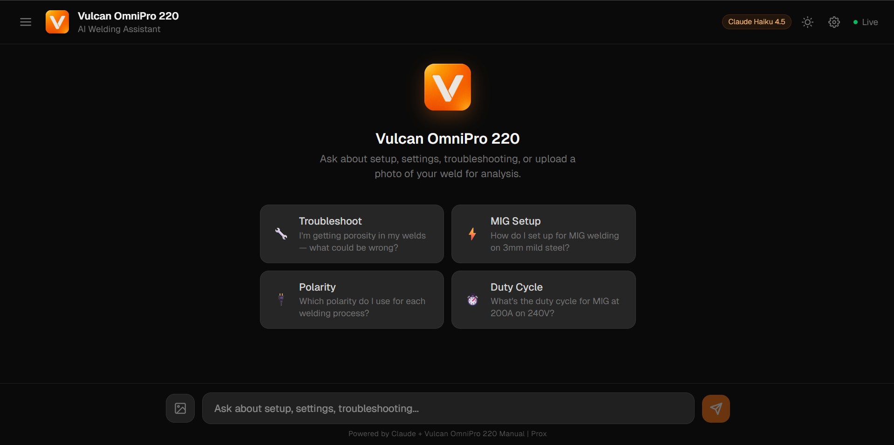
</div>

<br>

> Ask about duty cycles, polarity, troubleshooting, or settings and get manual-sourced answers with interactive artifacts. Upload a photo of your weld and get an honest quality assessment cross-referenced against the manual. Every answer is grounded in the machine's own documentation. No hallucinated specs, no generic welding advice.

<details>
<summary><strong>Light Mode</strong></summary>
<br>
<div align="center">
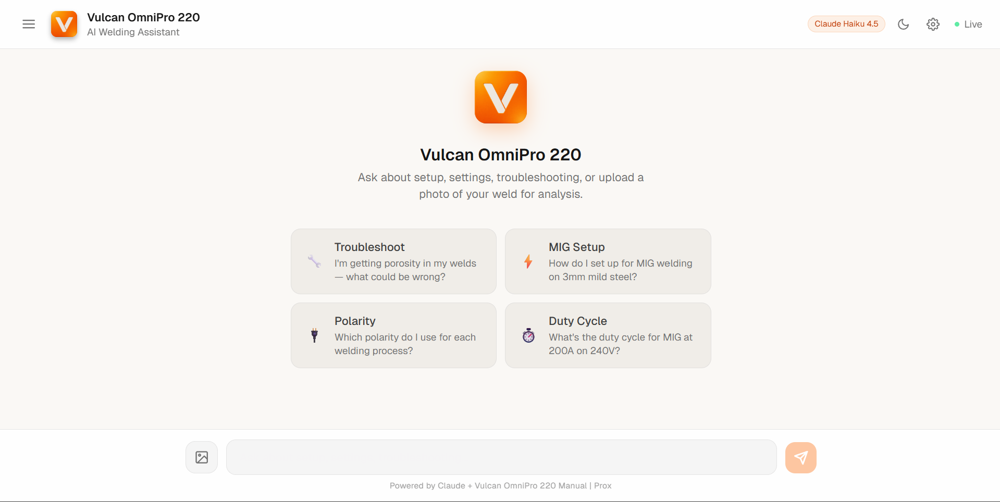
</div>
</details>

**Video walkthrough:** _[link]_

---

## Features

### RAG-Powered Answers
Hybrid search (vector + BM25) retrieves the most relevant manual chunks. Answers cite specific page numbers, rendered as **clickable badges** that open the actual manual page in a modal overlay.

### Interactive Artifacts
Four tool types generated as React components, rendered in sandboxed iframes:

<table>
<tr>
<td width="50%">

**Polarity Diagram**
Interactive wiring diagram with process selector (MIG / Flux-Core / TIG / Stick). Shows which cable goes to which socket.

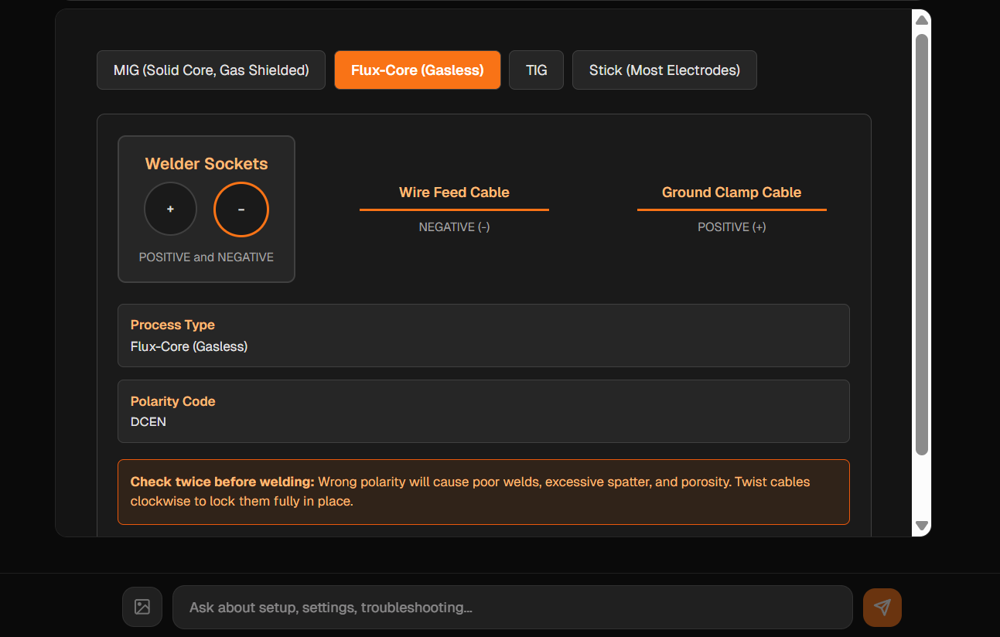

</td>
<td width="50%">

**Duty Cycle Calculator**
Filterable table by process and voltage. Shows amperage, duty cycle %, weld time, and rest time per 10-minute cycle.

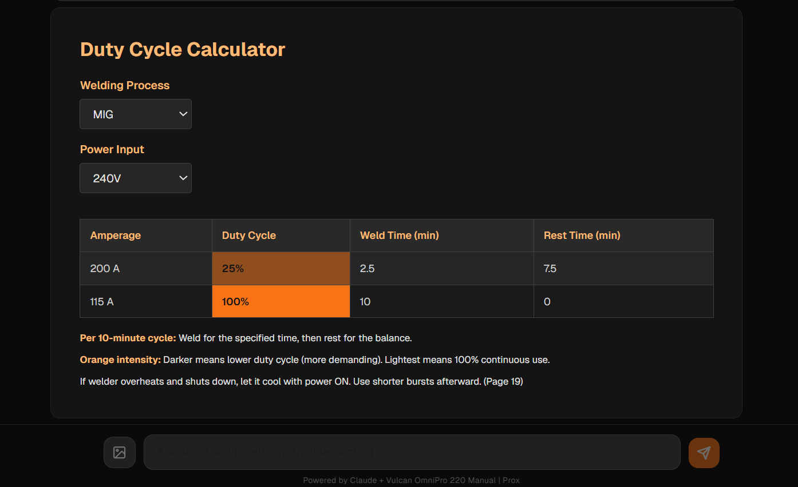

</td>
</tr>
<tr>
<td width="50%">

**Troubleshooting Flowchart**
Clickable decision tree that branches through Yes/No questions to specific manual fixes. Every branch ends at a concrete fix or "Call Vulcan support."

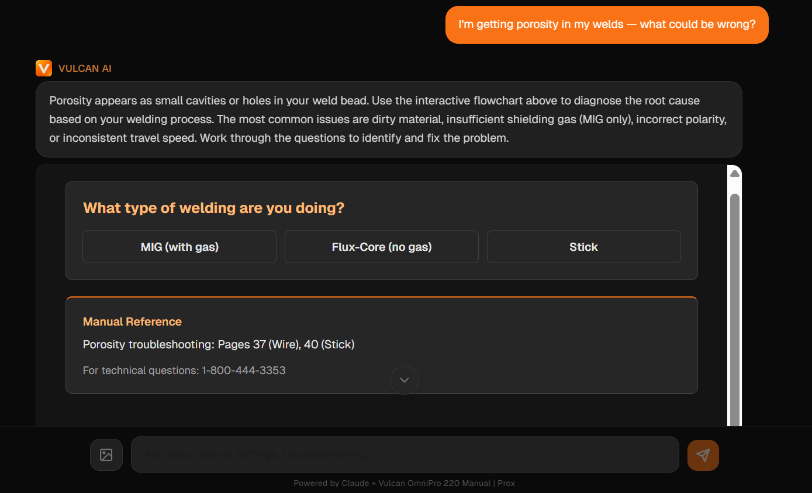

</td>
<td width="50%">

**Visual Technique Guides**
Angle diagrams, drag vs push technique, joint types. Generated on demand when users ask about technique.

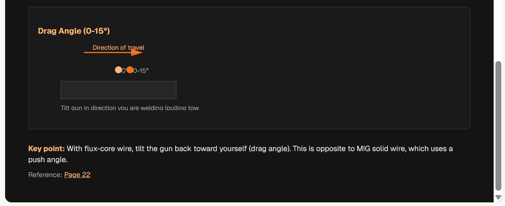

</td>
</tr>
</table>

### Pipeline Transparency
Animated status chips show each step in real time: **classify** > **retrieve** (with chunk count) > **generate**.

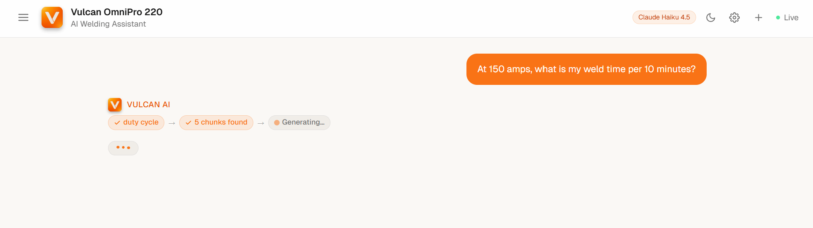

### Multimodal Weld Analysis
Drag-and-drop or click to upload a weld photo. Claude Vision analyzes it, identifies defects (or confirms quality), and references relevant manual sections. The system avoids the default-to-praise failure mode: if the weld is bad, it says so.

<table>
<tr>
<td width="50%">
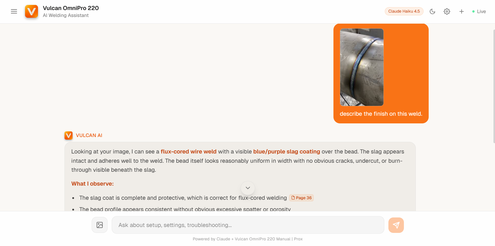
</td>
<td width="50%">

</td>
</tr>
</table>

### More Features

<table>
<tr>
<td width="50%">

**Conversation Memory** - Sidebar with auto-titled chat history (localStorage). New chat, load, delete. Last 4 exchanges sent as context.

**Document Library** - Expandable panel showing 3 ingested docs, page counts, and extraction methods.

</td>
<td width="50%">

**BYOK (Bring Your Own Key)** - API key stored in browser only, never sent to backend. Model selector: Haiku 4.5 / Sonnet 4.6 / Opus 4.6.

**Dark/Light Theme** - Full toggle via CSS custom properties. Every element adapts, including artifacts.

</td>
</tr>
</table>

<table>
<tr>
<td width="50%">
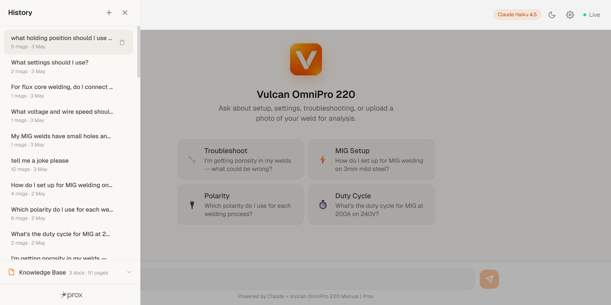
</td>
<td width="50%">
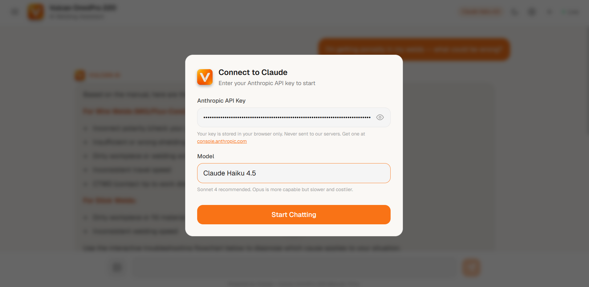
</td>
</tr>
</table>

---

## Architecture

```
User message (text + optional image)
        |
        v
  +-------------------------------------+
  |  1. Classify (Claude Haiku 4.5)     |  ~$0.0003, max_tokens=10
  |     > polarity | duty_cycle         |  Always Haiku, regardless of
  |     > troubleshoot | settings       |  main model setting
  |     > general                       |
  +-----------------+-------------------+
                    |
                    v
  +-------------------------------------+
  |  2. Hybrid Retrieval (local, $0)    |
  |     ChromaDB semantic search        |  cosine similarity
  |   + BM25 keyword search             |  exact term matching
  |     merged via Reciprocal Rank      |  k=60, with 50% threshold
  |     Fusion                          |  4-7 chunks per query
  +-----------------+-------------------+
                    |
                    v
  +-------------------------------------+
  |  3. Generate (Claude, streamed)     |  Type-specific artifact prompt
  |     Base system prompt              |  + RAG context + conversation
  |   + category artifact prompt        |  history (last 4 exchanges)
  |   + polarity/settings hardcoded     |  + image if uploaded
  |     facts as guardrails             |
  +-----------------+-------------------+
                    | SSE stream
                    v
  +-------------------------------------+
  |  Frontend                           |
  |  - Pipeline status chips (SSE)      |
  |  - Token-by-token markdown render   |
  |  - Artifact extraction + iframe     |
  |  - Page citation badges + modal     |
  +-------------------------------------+
```

### SSE Event Protocol

| Event | Payload | Purpose |
|-------|---------|---------|
| `status` | `{step, state, result?, chunks?}` | Pipeline progress (classify/retrieve/generate) |
| `metadata` | `{question_type, model}` | Classification result before tokens start |
| `token` | `{text}` | Streaming text chunks for progressive display |
| `error` | `{message}` | API errors (401, 404, 429) with user-friendly messages |
| `done` | `{tokens_used}` | Stream complete with total token usage |

---

## Hybrid Search: Why Both Vector and BM25

Technical welding queries fall into two categories that a single search mode cannot cover:

**Semantic queries** like "my welds are bubbly and full of holes" need vector similarity to find porosity content, even though the word "porosity" never appears in the query.

**Exact-term queries** like "DCEN polarity", "Dinse socket", or "duty cycle at 200A" need keyword matching because embedding models handle niche abbreviations poorly.

The system runs both searches and merges results using Reciprocal Rank Fusion:

```
RRF_score(chunk) = 1/(rank_vector + 60) + 1/(rank_bm25 + 60)
```

Chunks appearing in both result lists get boosted. A 50% threshold filter drops weak chunks that only marginally match. Retrieval depth varies by question type: troubleshooting pulls 7 chunks, polarity pulls 4.

The BM25 index is built once at server startup from the ChromaDB contents. Both searches are local, zero API cost.

---

## Knowledge Extraction

### Source Material

| PDF | Pages | Content | Extraction Method |
|-----|-------|---------|-------------------|
| `owner-manual.pdf` | 48 | Full technical reference: setup, all 4 welding processes, specs, troubleshooting tables | pdfplumber (structured table extraction) |
| `quick-start-guide.pdf` | 2 | Abbreviated setup with diagrams | pdfplumber (text) |
| `selection-chart.pdf` | 1 | Process selection matrix, pure image with no extractable text | Claude Vision API |

pdfplumber was chosen over pypdf because the manual's critical data lives in tables (duty cycles, amperage ranges, troubleshooting matrices). pypdf destroys row/column structure, making values like "200A" and "25%" no longer associated. pdfplumber extracts tables as structured markdown rows, preserving these relationships.

### Vision Extraction for Image-Based PDFs

`selection-chart.pdf` yields 0 characters from any text extractor. `ingest_vision.py` converts each page to JPEG at 200 DPI via Poppler, sends it to Claude Vision with a structured extraction prompt, and ingests the result into ChromaDB with `extraction: "vision"` metadata. Cost: ~$0.02-0.05.

### Chunking and Storage

Text is split into 500-word chunks with 50-word overlap. Table text is deduplicated against full-text extraction to avoid double-counting. ChromaDB uses all-MiniLM-L6-v2 embeddings (100% local). The pre-built index is committed to git so reviewers skip ingestion entirely.

| Metric | Value |
|--------|-------|
| Total chunks | 66 (64 pdfplumber + 2 vision) |
| Chunks per query | 4-7 (varies by question type, after RRF merge) |
| Avg retrieval tokens | ~2,900 |
| Full manual tokens | ~105,000 |
| Cost reduction vs full context | ~97% |

---

## Question Classification

A single Claude Haiku call (`max_tokens=10`, ~$0.0003) classifies each question. The classifier is hardcoded to Haiku regardless of the user's model selection.

| Category | Triggers | Artifact |
|----------|----------|----------|
| `polarity` | Cable connections, DCEP/DCEN, sockets, torch setup | Interactive polarity diagram with process selector |
| `duty_cycle` | Weld time, overheating, amperage limits, rest periods | Calculator with process/voltage dropdowns |
| `troubleshoot` | Porosity, spatter, arc issues, wire feeding, cracks | Clickable decision-tree flowchart |
| `settings` | Voltage, wire speed, gas type, material thickness | Text-only (directs to LCD auto-recommendation system) |
| `general` | Safety, maintenance, overview, how welding works | Text-only (artifact only if genuinely helpful) |

Each category injects a type-specific artifact prompt so Claude knows exactly what format to produce.

---

## Artifact Rendering

Claude's response contains React code wrapped in `<artifact type="react">` tags. The frontend extracts this and renders it in a sandboxed iframe:

- React 18 + ReactDOM loaded sequentially from unpkg CDN (sequential loading prevents blank-on-first-render race conditions)
- Babel standalone for JSX transpilation
- `sandbox="allow-scripts"` with no `allow-same-origin` (iframe cannot access parent DOM, cookies, or localStorage)
- Function-name aliasing maps any component name Claude generates to `Component`
- ResizeObserver dynamically adjusts iframe height (capped at 520px)
- Dark theme CSS injected into iframe to match the parent app

Artifacts can reference manual pages via `window.parent.postMessage({type: "openPage", page: N}, "*")`, which triggers the page image modal in the parent.

---

## Page Citation System

When the agent writes `(Page 22)` in its response, the frontend converts it into a clickable badge via regex matching in the ReactMarkdown pipeline. Clicking the badge opens a modal with a pre-rendered PNG of that manual page (generated offline by `generate_pages.py` and served from `/public/pages/`).

Inside artifacts, page references are clickable via `postMessage` to the parent window.

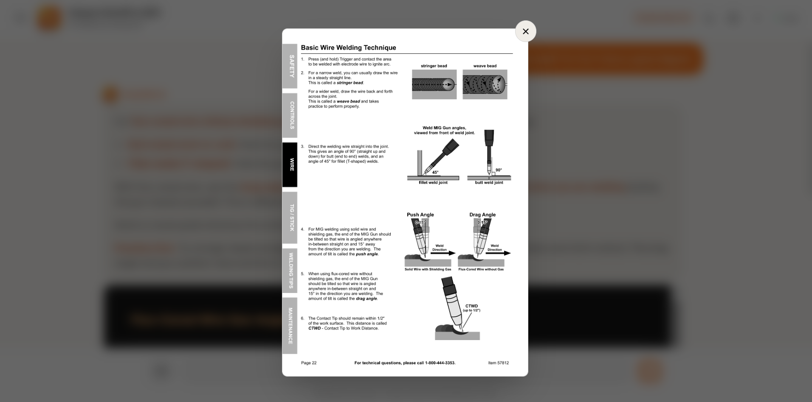

---

## Evaluation

### eval.py: 6 Hard Questions (6/6)

Six hand-crafted test cases targeting the hardest factual retrieval scenarios. Two-layer grading:

**Layer 1 (keyword):** Free, instant. Checks classifier category + required keywords in response + absence of wrong keywords.

**Layer 2 (LLM judge):** Claude Haiku reads ground truth from the manual + agent response, gives PASS/FAIL with reasoning. Catches paraphrased correct answers and subtle hallucinations that keyword matching misses.

| Test | Question | Tests |
|------|----------|-------|
| T1 | Duty cycle at 200A on 240V | Exact value retrieval (25%) |
| T2 | TIG polarity | DCEN, torch to negative terminal |
| T3 | Porosity causes | Must list shielding gas + at least one other cause |
| T4 | MIG settings for 1/8" steel | Must give guidance, not deflect entirely |
| T5 | Flux-core work clamp polarity | Positive socket, DCEN |
| T6 | "What settings should I use?" | Must ask for process, material, AND thickness |

```bash
python eval.py --api-key sk-ant-xxx --judge    # keyword + LLM judge (~$0.04)
python eval.py --api-key sk-ant-xxx --test T2  # single test
```

### stress_test.py: 50 Questions (49/50, effectively 50/50)

50 questions across 6 categories: MIG setup (8), polarity (7), duty cycle (6), troubleshooting (10), settings (8), general/safety (6), edge cases (5).

Tests for: crashes, timeouts, empty responses, error markers in output, and artifact brace mismatches. Does NOT check answer correctness (that is eval.py's job).

The 1 "failure" was a false positive: the word "500" appeared inside artifact React code (`width: 500px`) and was incorrectly flagged as a server error. The actual response was correct and cited Page 42 with specific causes.

Edge cases handled cleanly: vague questions trigger clarification requests, off-topic questions ("meaning of life") get redirected gracefully.

```bash
python stress_test.py --api-key sk-ant-xxx                    # all 50 sequential
python stress_test.py --api-key sk-ant-xxx --start 1 --end 10 # subset
python stress_test.py --api-key sk-ant-xxx --concurrency 3    # parallel
```

---

## Design Decisions

**RAG over full-context loading.** The full 48-page manual is ~105K tokens. Sending it every query costs ~$0.30 on Sonnet. Hybrid retrieval pulls only relevant chunks at ~$0.008/query. 97% cost reduction.

**Hybrid search over pure vector.** Pure cosine similarity misses exact terms like "DCEN" and "200A" because embedding models handle niche abbreviations poorly. BM25 catches these. RRF merges both.

**Claude classifier over keyword matching.** The initial implementation used hardcoded keyword matching. It was brittle: "my cables are backwards" missed, "how long can I run it?" missed. A single Haiku call handles natural language at negligible cost.

**SSE streaming over request/response.** Claude generates long responses with artifacts (2000+ tokens). Without streaming, the user stares at a spinner for 5-8 seconds. With SSE, the first token is visible in 1-2 seconds.

**BYOK over server-side key.** The user's API key is stored in the browser and sent via `X-API-Key` header. The backend never stores keys. This means anyone can try the demo without sharing credentials, and the backend has zero credential management.

**Stateless backend.** The frontend owns conversation history and sends the last 4 exchanges per request. The backend is a pure function. No sessions, no database beyond the read-only vector index.

**Pre-committed vector index.** The ingestion pipeline runs locally once. The resulting ChromaDB directory is committed to git. Reviewers clone, install, and run with zero ingestion wait.

**Hardcoded polarity facts.** The system prompt contains manually verified polarity values for all 4 processes. If retrieved chunks contradict these (due to noisy extraction), the hardcoded facts take priority. This prevents the most dangerous category of error: wrong cable connections.

---

## Project Structure

```
prox-challenge/
├── api.py                 # FastAPI backend: classifier, hybrid search, SSE streaming
├── ingest.py              # PDF text+table extraction (pdfplumber) to ChromaDB
├── ingest_vision.py       # Vision extraction for image-based PDFs to ChromaDB
├── generate_pages.py      # Renders manual pages to PNGs for the citation modal
├── requirements.txt       # Python: anthropic, fastapi, chromadb, pdfplumber, rank-bm25
├── render.yaml            # Render deployment config
├── .env.example           # Template for ANTHROPIC_API_KEY
├── chroma_db/             # Pre-committed vector index (66 chunks, git-tracked)
├── files/                 # Source PDFs (owner manual, quick start, selection chart)
├── static/                # Manual page images served by FastAPI
│
├── eval/
│   ├── eval.py            # 6-question eval with keyword + LLM judge grading
│   └── stress_test.py     # 50-question crash/stability test
│
└── frontend/              # Next.js 16 + React 19 + Tailwind v4
    ├── app/
    │   ├── page.tsx       # Single-file app: chat UI, artifact renderer, sidebar,
    │   │                  #   pipeline indicator, image upload, page citation modal,
    │   │                  #   conversation history, API key modal, theme toggle
    │   ├── layout.tsx     # App layout + metadata
    │   └── globals.css    # CSS custom properties for dark/light theming
    ├── public/
    │   ├── pages/         # Pre-rendered manual page PNGs for citation modal
    │   ├── logo.png       # Vulcan V icon
    │   └── prox-logo.png  # Prox branding
    └── package.json
```

---

## Setup

```bash
git clone https://github.com/krtk-ptl/prox-challenge.git
cd prox-challenge

cp .env.example .env
# Required: add your ANTHROPIC_API_KEY (used only for ingestion/eval scripts)
```

**Start backend** (Terminal 1):
```bash
pip install -r requirements.txt
python -m uvicorn api:app --port 8000
```

**Start frontend** (Terminal 2):
```bash
cd frontend
npm install
npm run dev
```

Open **http://localhost:3000**, enter your Anthropic API key in the modal, and start asking.

The pre-built ChromaDB index ships with the repo (66 chunks). No ingestion step required. The only thing the running app needs is an API key entered in the browser.

---

## Regenerating the Index

Only needed if you modify parsing or chunking logic. The app works without this step.

```bash
# Text + table extraction (free, local only)
python ingest.py

# Vision extraction for image-based PDFs (~$0.02-0.05, uses Claude Vision)
python ingest_vision.py
```

Both scripts are idempotent.

---

## Tech Stack

| Layer | Technology |
|-------|-----------|
| Frontend | Next.js 16, React 19, Tailwind CSS v4, react-markdown, remark-gfm |
| Backend | Python 3.12, FastAPI, Anthropic SDK, SSE streaming |
| PDF Extraction | pdfplumber (structured tables), Claude Vision API (image PDFs) |
| Search | Hybrid: ChromaDB vector (all-MiniLM-L6-v2) + BM25 (rank-bm25), merged via RRF |
| Classification | Claude Haiku 4.5 (hardcoded, ~$0.0003/call) |
| Generation | Claude (user-configurable: Haiku 4.5 / Sonnet 4.6 / Opus 4.6) |
| Deployment | Vercel (frontend), Render (backend) |

---

## Known Limitations

- **Response time:** 11-17s average. Render free-tier cold starts + Haiku classifier + main model generation. A production deployment on paid infrastructure would cut this significantly.
- **Stress test judge mode:** The stress test checks for crashes and errors, not correctness. Correctness is eval.py's domain (6/6 with LLM judge).
- **Single-product scope:** The agent only knows the Vulcan OmniPro 220. It will say so if asked about other welders.
- **Artifact token budget:** Artifacts are capped at ~180 lines to avoid truncation. Complex troubleshooting flowcharts occasionally hit this limit and simplify their branching.

---

*Built for the [Prox Founding Engineer Challenge](https://useprox.com/join/challenge).*
